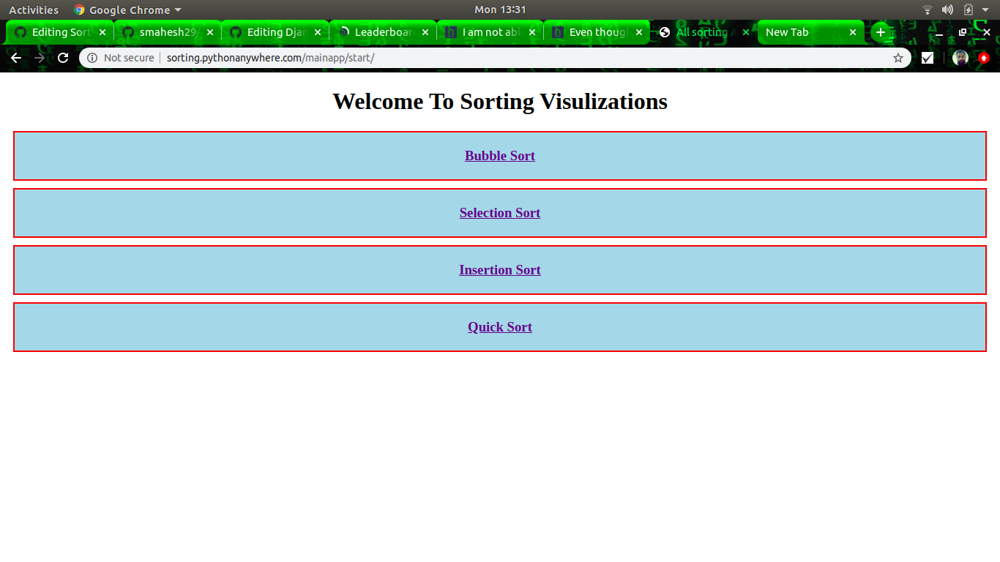
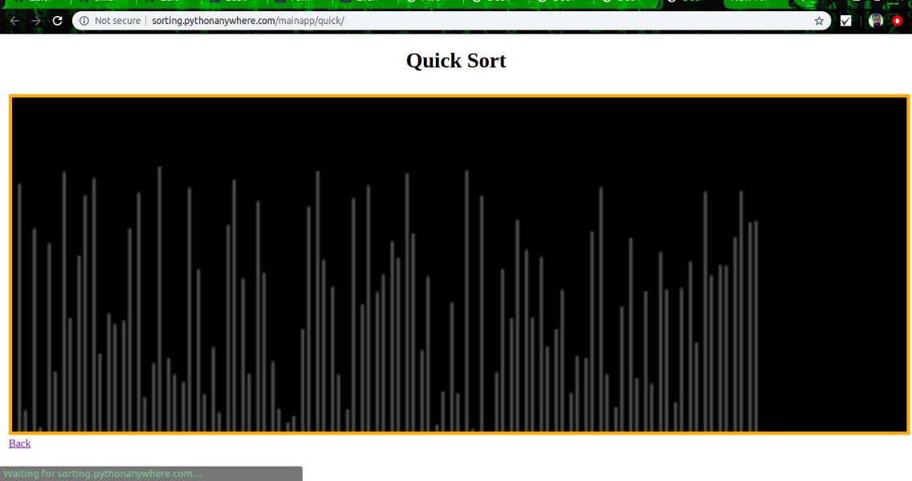
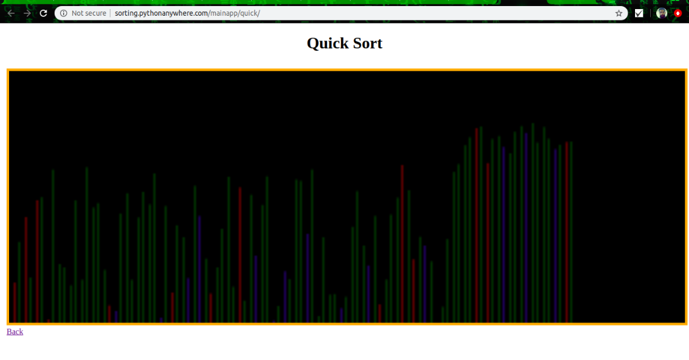
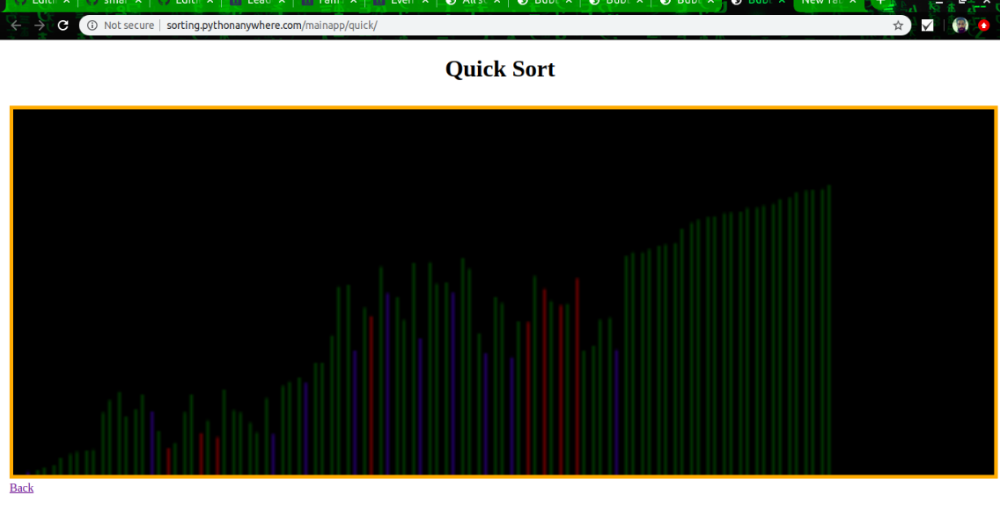
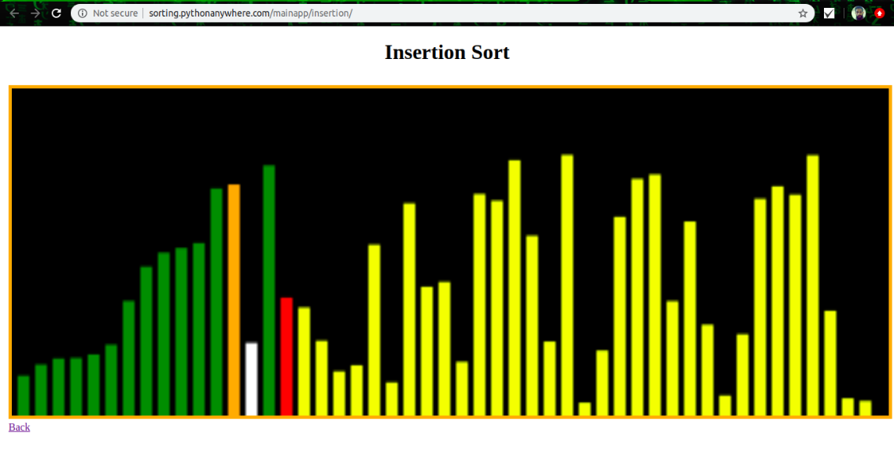
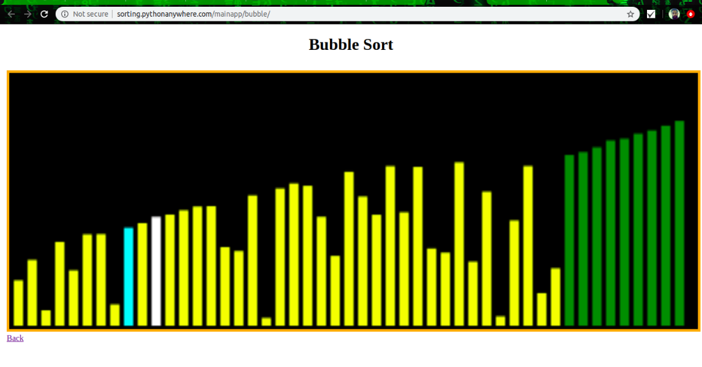
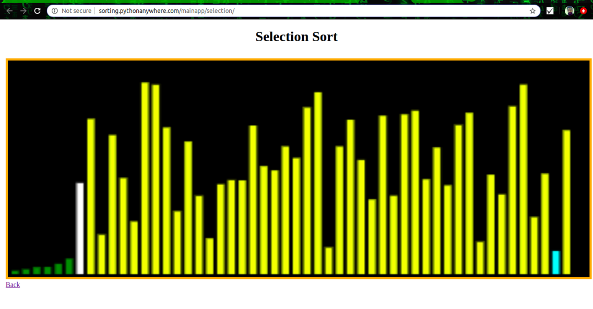

# Django-WebApp     
<h3>Projet Live </h3>: http://sorting.pythonanywhere.com/mainapp/

This project was done by me to make understanding easyer for Algorithms learner.
It's A part of Hole Project Called - <h5>All Algo Visulization</h5>

<h2>Assignment Problem Statement:</h2>

<h4>Idea</h4>
<ol>
     <li>Four Basic Sorting technic </li>
     <li>Bubble Sort</li>
     <li>Insertion Sort</li>
     <li>Selection Sort</li>
     <li>Quick Sort</li>
</ol>

<h2>Technologies Used:</h2>
<ul>
    <li>Python</li>
    <li>Django</li>
    <li>JavaScript</li>
</ul>
    

  
<h2>Note :</h2>

<b>The Secret_Key required for the execution and debugging of project is not removed from the project code. So you can use the project as your college mini-project or by using the project code you can build your own project.</b>

<h2>Usage :</h2>

    python django_web_app/manage.py runserver
    
   In your web browser enter the address : http://localhost:8000 or http://127.0.0.1:8000/

# Screenshots : 

# Support :
If you found this project helpful or you learned something from the source code and want to thank me, consider me to pay my internet bills. This would encourage me to create many such projects 👨🏻‍💻
<ul>
    <li><b>G Pay :</b> +918918821176</li>
    <li><b>PhonePe :</b> +918918821176</li>
</ul>
